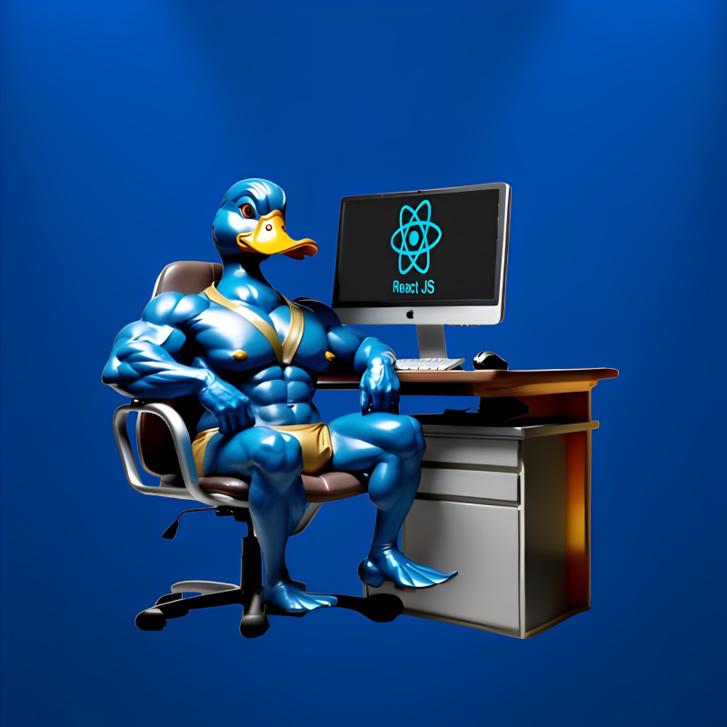

   
  <h1 align="center">Shirt 3D</h1>

 

# Sobre o projeto
### Um projeto utilizando do 3D como base, onde há a possibilidade de customização de uma camisa
## Layout 

- React.js - Vite
- Tailwind
- Models 3D

# Autor

## @Duck.Web

<!-- INSTAGRAM -->

